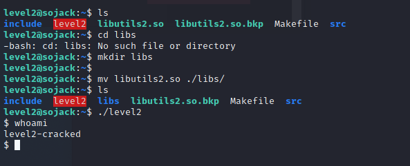

# Shared Objects hijacking

## Description :
> Dans ce challenge, les vulnérabilités liées à la mauvaise configuration des librairies partagées sont explorées.
>
> Le défi se compose de 5 niveaux, chaque niveau portant sur une vulnérabilité différente.
>
> Le document joint au défi a été très utile pour trouver le flag pour chaque niveau.


## Exploit : 

> **Level 1**
> 
> Au premier niveau, le binaire et la librairie sont tous deux situés dans le dossier home.
> 
> En utilisant `objdump -x level1` on peut voir que la librairie **libutils1.so** située dans le répertoire courant (RUNPATH .) est en fait requise.
> 
> 
> 
> En outre, un utilisateur a les droits de modification dans le dossier actuel, c'est-à-dire qu'il est possible de manipuler **libutils1.so**.
> 
> En explorant le dump du binaire désassemblé, on peut voir que la fonction **better_printf()** est appelée depuis la librairie.
> 
> Pour exploiter la faille, il suffit donc de compiler une nouvelle bibliothèque dans laquelle sera implémentée une fonction ayant la même signature, soit **better_printf()**.
>
> La nouvelle fonction se chargera de récupérer les droits de superutilisateur, fournis par le bit **s** du binaire **level1**, et de lancer un shell.
>
> ```
> #include <stdlib.h>
> #include <unistd.h>
>
> void better_printf(){
>    setreuid(geteuid(),geteuid());
>    system("/bin/sh");
>}
> ```
> 
> Il ne reste plus qu'à compiler la nouvelle librairie, à remplacer l'ancienne et à exécuter le binaire **niveau 1**.
> 
> Le flag trouvé, et à utiliser pour le niveau 2, est : **RUNPATH_should_be_absolute**
> 


> **Level 2**
> 
> Comme dans le premier niveau, en utilisant `objdump -x level2` on peut voir que, cette fois, la librairie doit être située dans le dossier **/home/level2/libs/**.
>
> 
> 
> Comme le dossier n'existe pas, l'exécution du binaire échoue.
> 
> Il suffit donc de le créer et d'y déplacer la librairie. 
> 
> La librairie sera le même payload que celui utilisé au niveau précédent.
> 
> 
> 
> Le flag trouvé, et à utiliser pour le niveau 3, est : **RPATH_is_old_but_still_might_exist**
 

> **Level 3**
> 
> 
> Dans ce niveau, le binaire **level3** utilise la librairie située dans le dossier **/lib**.
> 
> Cependant, l'utilisateur a les droits de modification sur le fichier **/lib/libutils3.so**.
> 
> 
> 
> Il suffit donc d'écraser le fichier avec le payload utilisé dans les niveaux précédents pour monter les privilèges.
> 
> 
> 
> Le flag trouvé est : **check_permissions_of_dependencies**
 
> **Level 4**
> 
> À ce niveau, le binaire ne reconnaît pas la librairie, car le chemin d'accès à celle-ci est absent.
> 
> Toutefois, il est possible de spécifier le chemin d'accès à la librairie à l'aide de la variable LD_LIBRARY_PATH au moment de l'exécution.
> 
> De plus, le binaire doit être exécuté avec des privilèges élevés afin d'exploiter cette faille.
> 
> Avec `sudo -l`, on peut voir qu'il est possible d'exécuter le binaire avec les droits **level4-cracked**.
> 
> 
>
> Il suffit donc de réutiliser le même payload que les niveaux precedents, en le placent dans un dossier connu (dans ce cas **/tmp/ex**) 
> 
> 
> 
> Le flag trouvé est : **sudoers_defaults_protects_against_setuid_abuse**


> **Level 5**
> 
> À ce dernier niveau, le chemin d'accès à la librairie est spécifié dans un fichier de configuration dans le répertoire **/etc/ld.so.conf.d/**.
> 
> 
> 
> Il faut donc créer un dossier **libs** dans **/home/level5** pour exploiter ce dernier binaire.
>
> 
>
> En suite, il suffit de placer la librairie dans ce dossier pour spawn le shell ayant les droits de lecture du dernier flag.
> 
> 
> 
> flag : **ld.so.conf_should_stay_standard_Congrats_btw_the_chall_is_over!**
 

> Le flag de validation est le SHA256 de la concatenation des 5 flags.

