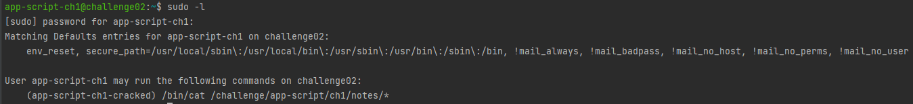

# sudo - weak configuration

# Description : 

> Comme son titre l'indique, ce défi met en évidence une vulnérabilité causée par une mauvaise configuration de `sudo`.

# Exploit : 

> Il suffit donc de lancer la commande `sudo -l` pour vérifier ce qui peut être exécuté en mode privilégié.
> 
> 
> 
> En suivant la syntaxe proposée ici, il est possible de montrer le contenu des fichiers appartenant à l'utilisateur **app-script-ch1-cracked** avec la commande `cat`, à condition que le premier fichier montré soit */challenge/app-script/ch1/notes/shared_notes*.
> 
> La solution proposée est la suivante:
> `sudo -u app-script-ch1-cracked -S cat /challenge/app-script/ch1/notes/shared_notes /challenge/app-script/ch1/ch1cracked/.passwd`
> 
> Le flag obtenu est : **b3_c4r3ful_w1th_sud0**