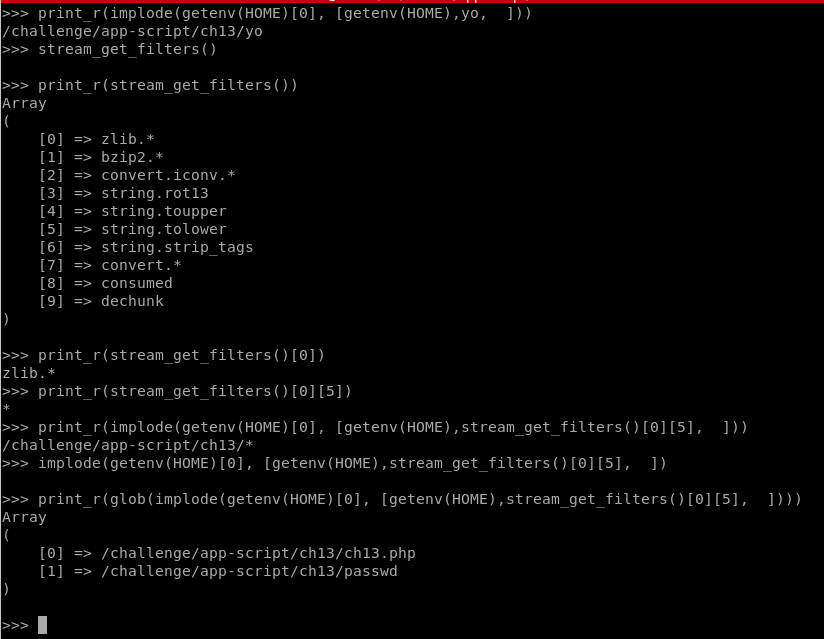
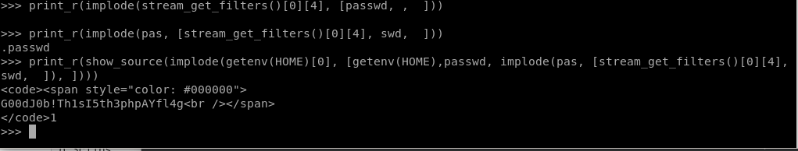

# PHP - Jail

## Description : 
> Dans ce défi, le fichier **.passwd** situé dans un sous-dossier doit être affiché. Pour ce faire, il faudra utiliser la ligne de commande, qui consiste à évaluer l'entrée via la fonction **eval** de PHP.
> Certains caractères sont filtrés par la ligne de commande, ce qui complique l'injection de payloads. En outre, certaines commandes interrompent la connexion avec le challenge, ce qui rend la recherche de la solution plus fastidieuse. Il est donc recommandé d'utiliser un script pour automatiser la phase de connexion au défi. Dans notre cas, nous nous sommes appuyés sur un script **expect** pour automatiser la connexion.

## Exploit :
> Pendant la phase d'exploration, certaines primitives PHP peuvent être utilisées pour exfiltrer des informations sur le code source de la jail et l'environnement PHP.
> 
> Pour les informations concernant l'environnement PHP il suffit d'appeler `phpinfo()`
> 
> Il est possible de récupérer le contenu des variables d'environnement avec `get_env()`
> 
> Pour afficher le contenu d'un fichier, il faut utiliser `show_source()`
> 
> Pour afficher le contenu d'un dossier, il faut utiliser `glob()`
> 
> Enfin, pour afficher le contenu sur le terminal, il faut utiliser `print_r()`
> 
> Comme annoncé précédemment, certains caractères sont filtrés par la ligne de commande. C'est le cas des caractères `*` et `.` .
> Le caractère `*` sera utilisé pour afficher le contenu du dossier actuel, afin de localiser le sous-dossier dans lequel se trouve le flag, tandis que le caractère `.` sera utilisé pour composer le nom du flag.
> 
> Donc à ce stade, il faut trouver un moyen de réassembler ces caractères par des méthodes légitimes. 
> 
> Nous nous basons principalement sur les résultats fournis par `phpinfo()`. Par exemple, parmi les différentes informations, il y a une ligne appelée **Registered Stream Filters** qui contient plusieurs noms, dont certains se terminent par le caractère `*`. Il suffit alors de récupérer la liste de ces noms avec `stream_get_filters()` et ensuite de récupérer le caractère `*` en utilisant son index dans le nom.
>
> La concatenation des caractères se fait avec la methode `implode()`
> 
> 
> 
> Donc, à ce point, on peut voir qu'il y a un dossier appelé **passwd**.
> 
> Parmi les différents caractères filtrés figure le caractère `/`, qui doit être utilisé pour composer le chemin vers le flag.
> 
> Comme précédemment, il suffit de retrouver ce caractère à partir des informations rencontrées lors des étapes précédentes. Dans ce cas, il suffira de récupérer le caractère à l'indice 0 de `get_env(HOME)` qui affichera un `/`.
> 
> 
> 
> Le flag trouvé est : **G00dJ0b!Th1sI5th3phpAYfl4g**
