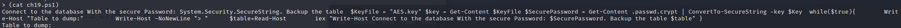
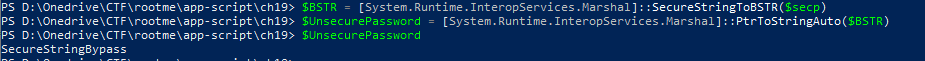

# Powershell - SecureString

## Description
> Le but de ce défi est celui de decipher le mot de passe, encodé avec SecureString.
> 

## Exploit
> Il est possible d'exécuter des commandes à travers des parenthèses
> 
> 
>
> Dans ce cas, il a été possible de récupérer le code source du défi.
> 
> ```
> $KeyFile = "AES.key" 
> $key = Get-Content $KeyFile 
> $SecurePassword = Get-Content .passwd.crypt | ConvertTo-SecureString -key $Key  
> ```
> 
> Le contenu des fichiers **AES.key** et **.passwd.crypt** est accessible en lecture.
> 
> **AES.key**: ```3 4 2 3 56 34 254 222 1 1 2 23 42 54 33 233 1 34 2 7 6 5 35 43```
> 
> **.passwd.crypt**: ```76492d1116743f0423413b16050a5345MgB8AEkAMQBwAEwAbgBoAHgARwBXAHkAMgB3AGcAdwB3AHQARQBqAEEARQBPAEEAPQA9AHwAMgAyAGMANQA1ADIANwBiADEANQA4ADIANwAwAGIANAA2ADIAMQBlADAANwA3ADIAYgBkADYANgAyADUAYwAyAGMAYQBhAGUAMAA5ADUAMAA2ADUAYQBjADIAMQAzADIAMgA1AGYANgBkAGYAYgAxAGMAMgAwADUANQBkADIAMgA0AGQAYgBmADYAMQA4AGQAZgBkAGQAMwAwADUANAA4AGYAMAAyADgAZAAwADEAMgBmAGEAZQBmADgANAAyADkA```
> 
> Avec un peu de rétro-ingénierie, il est possible de répéter le mécanisme d'encodage du mot de passe sur sa propre machine.
> 
> 
>
> 
> 
> Le flag trouvé est : **SecureStringBypass**
>