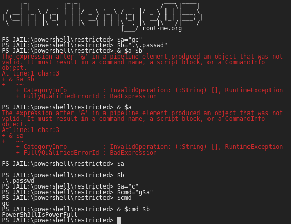

# Powershell - Basic jail

## Description
> Le but de ce challenge est celui d'afficher le contenu du fichier **.passwd** depuis une ligne de commande Powershell.
> 
> Les règles de filtrage de la ligne de commande empêchent l'exécution des commandes importantes. 

## Exploit
> Pour afficher le contenu d'un fichier on pourrait utiliser la commande `Get-Content`.
> 
> Cependant, le caractère `-` est filtré. Il existe un alias pour cette commande, `gc`, mais hélas la suite de caractères **g** et **c** est filtré aussi.
> 
> Puisque les caractères seuls ne sont pas filtrés, il est possible de construire la commande `gc` à partir de la concatenation de caractères. 
> 
> L'exploit consiste donc à construire le payload en utilisant des variables, et donc, en concatènent ces variables. 
> 
> 
> 
> 
> Le flag trouvé est : **PowerSh3llIsPowerFull**
