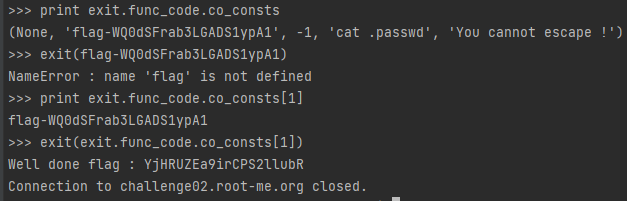

# Python - PyJail 1

## Description : 
> Comme pour les autres pyjail, le but de ce challenge est de sortir de la sandbox en appellant la fonction **exit()**
> 
> Il est donc important de faire de l'introspection pour comprendre quel argument il faut passer à **exit()**

## Exploit : 

> Comme indiqué dans le banner du challenge au moment de la connexion, l'exploit se fait en passant par la fonction **exit()**
>
> La plupart de commandes utiles pour l'introspection (comme **dir, \_\_dict\_\_**) sont filtrées.
> 
> Cependant, avec un peu de guessing, il était possible d'exfiltrer des informations concernant les attributs de la fonction.
> 
> En effet, on a quelque chose d'intéressant avec **exit.func_code.co_consts**
> 
> 
> 
> En rentrant donc `exit(exit.func_code.co_consts[1])` il a été possible de sortir de la jail. 
> 
> Le flag est : **YjHRUZEa9irCPS2llubR**