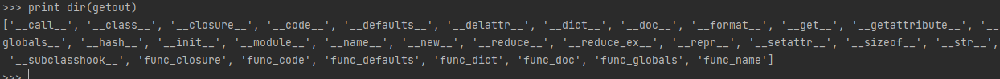
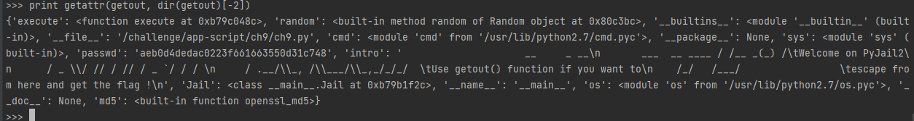

# Python - PyJail 2

# Description : 
> Dans cette prison python, pour sortir, il faut appeler la fonction **getout()** en lui passant le bon paramètre.
> Il est donc nécessaire de s'appuyer sur des techniques d'introspection pour trouver ce paramètre.
> En outre, certains mots-clés, tels que **globals**, sont filtrés. Il sera donc nécessaire de trouver un moyen de contourner cette limitation.

# Exploit : 
> Avec **dir()** il est donc possible de voir les modules présents. Nous nous intéressons à **getout** et continuons l'exploration avec **dir(getout)**.
> 
> 
> Nous trouvons ici un attribut intéressant appelé **func_globals**. Afin d'explorer cette voie, nous devons contourner le filtre sur le mot **globals**.
> Pour ce faire, il suffira de récupérer l'élément de la liste en utilisant son index avec `dir(getout)[-2]`.
> 
> À ce stade, en explorant **func_globals**, on constate qu'il existe un élément appelé **passwd** contenant une série de caractères.
> 
> 
> Il est donc nécessaire de récupérer le chemin vers ce mot clé afin de le passer en paramètre à la fonction **getout()**, sachant que le mot **passwd** est également filtré par la jail.
> 
> Le payload final sera donc 
> 
> `getout(getattr(getout, dir(getout)[-2])[list(getattr(getout, dir(getout)[-2]))[-7]])`
> 
> Ce qui donne comme flag : **ValidateMeDude!**