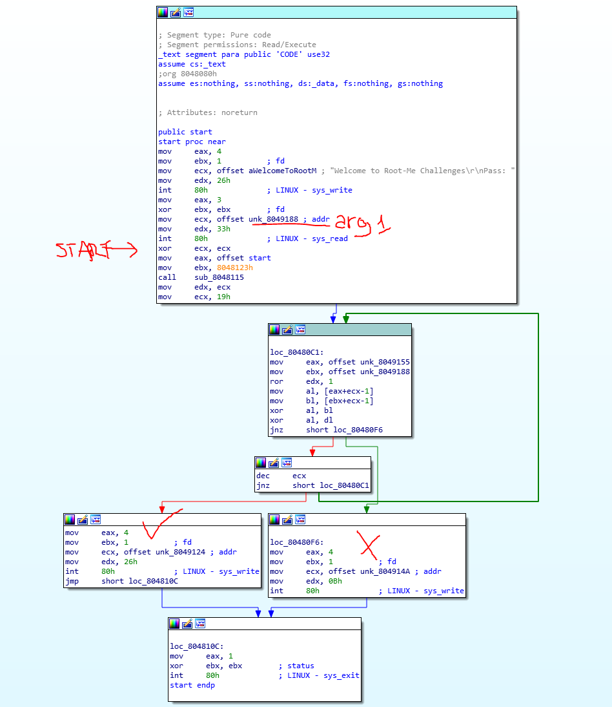
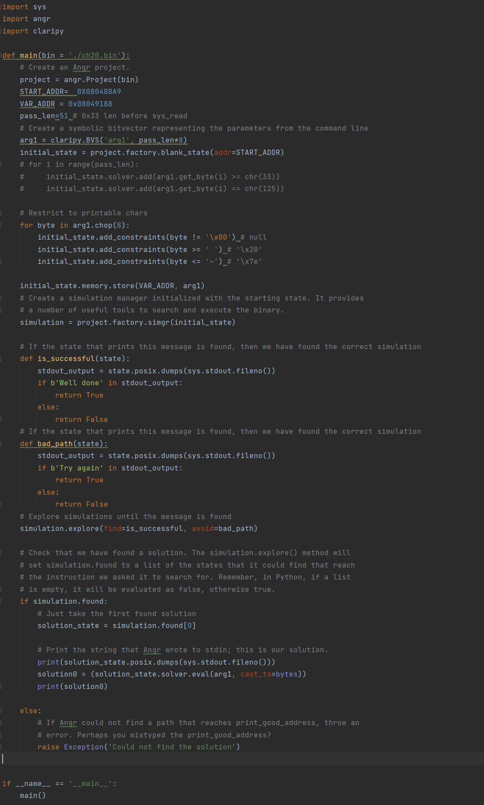
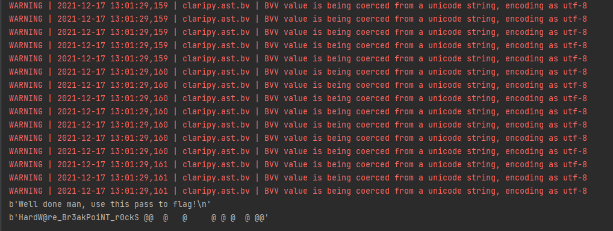

# ELF x86 - No software breakpoints

## Description
> Dans ce défi, l'utilisation des points d'arrêt du débogueur n'est pas autorisée, il faut donc trouver un autre moyen de trouver le flag.
> 
## Exploit
> En analysant le binaire avec `IDA Freeware`, il est possible de voir l'arborescence du programme.
>
> 
> 
> Pour résoudre ce problème, on peut utiliser `angr`. Cet outil, grâce à l'analyse concolique, permet d'extraire la séquence d'octets nécessaire pour atteindre la branche souhaitée dans le programme.
> 
> Dans ce cas, `angr` sera configuré pour commencer l'analyse après les instructions demandant l'entrée de l'utilisateur (indiqué **START** en rouge dans l`image ci-dessus).
> 
> On peut aussi remarquer que l'input est stocké à l'adresse **0x08049188** (en rouge **arg1**) et que la taille de l'input est de **0x33**, ou bien, 51 bytes.
>
> On peut limiter le nombre d'octets possibles aux caractères imprimables.
> 
> Ensuite, il est nécessaire de préciser quelle branche doit être atteinte et laquelle doit être évitée
> 
> Le script final est donc: 
> 
> 
> 
> Execution...
> 
> 
> 
> Le flag trouvé est : **HardW@re_Br3akPoiNT_r0ckS**