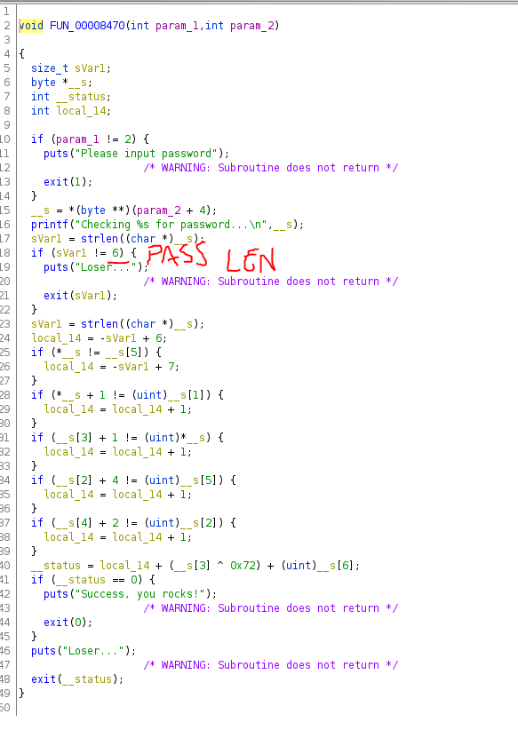
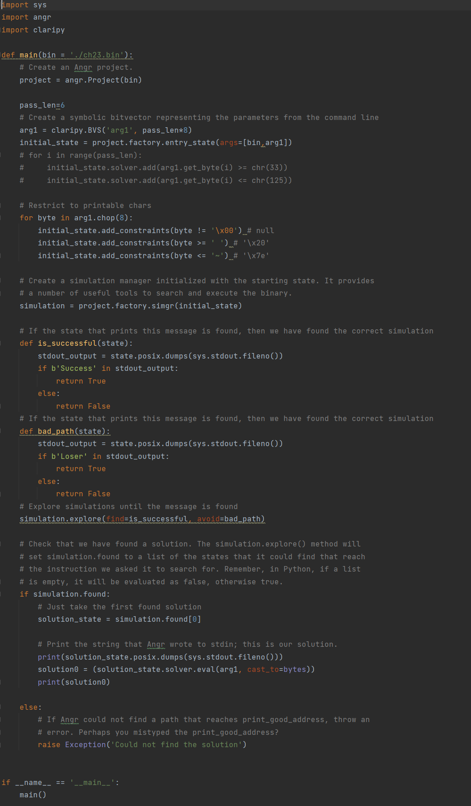
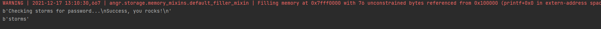

# ELF ARM - Basic Crackme

## Description
> Challenge crackme basique sous ARM
> 
## Exploit
> 
> En ouvrant le binaire avec `IDA Freeware`, on remarque que le programme demande à l'utilisateur en argument un input de taille 6.
> 
> En suite des opérations sont effectués sur cet input.
> 
> 
> 
> Il est possible résoudre facilement ce challenge avec `angr`.
> 
> En spécifiant comme taille d'input **6** et comme branche cible celle qui affiche le message **Success, you rocks!**
> 
> Le script donc rassemble à 
> 
> 
> 
> Execution...
> 
> 
> 
> Le flag trouvé est : **storms**