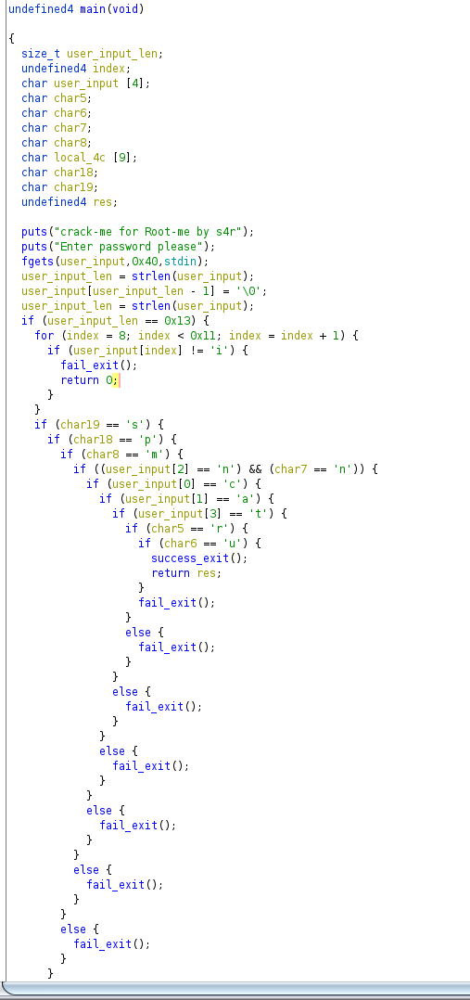

# ELF MIPS - Basic Crackme

## Description
> Challenge crackme basique sous MIPS
> 
## Exploit
> En ouvrant le binaire avec ``ghidra``, on peut reconstituer une version du code en **C** à partir de l'assembleur.
> 
> 
> 
> On peut remarquer qu'au moment de la demande d'input, la fonction `fgets` récupère beaucoup plus de caractères (**0x40**) que la taille du buffer **user_input**.
> 
> On en déduit que, les caractères à l'index>3 de l'input utilisateur, vont être stockés dans les variables **char** adjacentes (**char5, char6...**).
> 
> On peut donc en déduire, à partir de tests **if**, quels caractères composent le flag.
> 
> À noter que la boucle **for** vérifie si à partir de l'indexe 8 de l'input il y a bien 9 caractères **i**.
> 
> Le flag trouvé est: **cantrunmiiiiiiiiips**