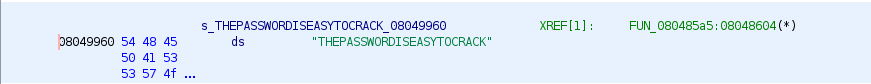

# ELF x86 - CrackPass

## Description
> Le but de ce défi est de trouver l'entrée correcte qui, par une phase de xor, permet de passer de la branche correcte de **if**.
> 
## Exploit
> En explorant ce binaire avec `ghidra` on remarque que pour arriver au message **Good Work [...]**, il faut que la comparison avant le **if** soit positive.
> 
> 
> 
> 
> On remarque que la fonction **FUN_0804851c** effectue des operations avec une valeur constante **s_THEPASSWORDISEASYTOCRACK**
> 
> Le contenu de cette constante est : 
> 
> 
> 
> En récupérant le code de **FUN_0804851c** et la constante, il a été possible d'exécuter la fonction en locale.
> 
> 
> 
> Ce qui a permis de générer le flag : **ff07031d6fb052490149f44b1d5e94f1592b6bac93c06ca9**